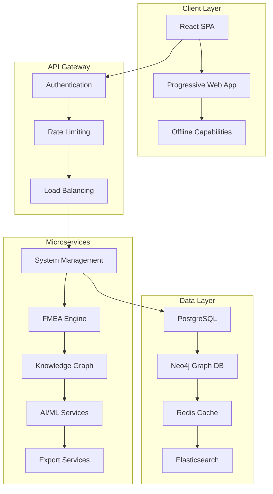
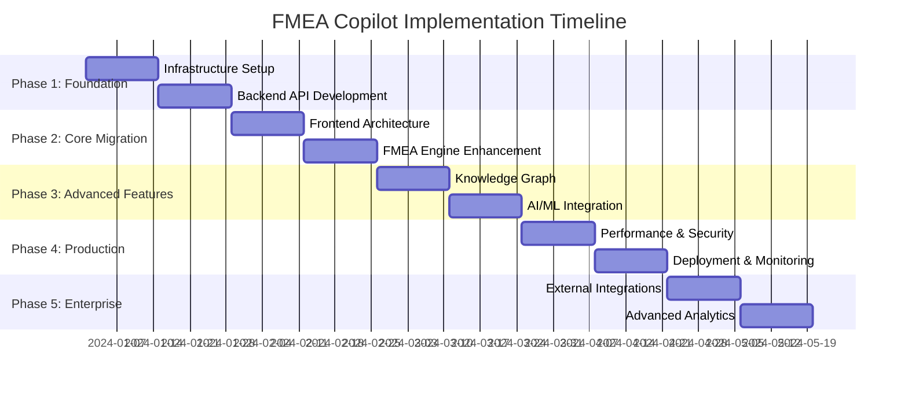

# FMEA Copilot - Executive Summary & Architectural Overview

## Executive Summary

The FMEA Copilot project represents a transformative approach to automotive failure mode and effects analysis, leveraging modern web technologies, artificial intelligence, and knowledge graph databases to revolutionize how automotive engineers conduct safety-critical system analysis.

This document provides an executive overview of the comprehensive architectural design for migrating the existing React prototype to a production-ready, enterprise-grade application capable of serving the automotive industry's most demanding requirements.

## Project Vision & Objectives

### Primary Goals
- **Accelerate FMEA Process**: Reduce FMEA completion time by 60-70% through AI-powered automation
- **Improve Analysis Quality**: Leverage historical data and knowledge graphs for more comprehensive failure analysis
- **Enable Collaboration**: Support real-time multi-user collaboration on FMEA documents
- **Ensure Compliance**: Meet automotive industry standards (ISO 26262, FMVSS) and audit requirements
- **Scale Enterprise-wide**: Support 1000+ concurrent users across global automotive organizations

### Business Value Proposition
- **Cost Reduction**: $2-5M annual savings through process efficiency and error reduction
- **Risk Mitigation**: 30-50% reduction in post-production safety issues through better analysis
- **Time to Market**: 20-30% faster product development cycles
- **Compliance Assurance**: Automated compliance checking and audit trail generation
- **Knowledge Preservation**: Institutional knowledge capture and reuse across projects

## Current State Analysis

### Existing Prototype Strengths
✅ **Modern React Foundation**: React 18.2.0 with Material-UI provides solid UI framework  
✅ **Rich Visualization**: Recharts and D3.js integration for comprehensive data visualization  
✅ **Knowledge Integration**: Cytoscape.js for complex relationship visualization  
✅ **Authentic Data**: Real automotive component database with genuine failure modes  
✅ **Complete Workflow**: End-to-end FMEA process implementation  
✅ **AI Integration**: Intelligent failure mode suggestions based on system analysis  

### Critical Gaps Identified
❌ **Scalability Limitations**: Single-page application architecture cannot support enterprise scale  
❌ **Data Persistence**: In-memory data storage unsuitable for production use  
❌ **Security Vulnerabilities**: No authentication, authorization, or data protection  
❌ **Performance Issues**: Large bundle sizes and unoptimized rendering for complex datasets  
❌ **Collaboration Barriers**: No multi-user support or real-time collaboration features  
❌ **Integration Challenges**: No connectivity to existing enterprise systems (PLM, ERP)  

## Architectural Transformation Strategy

### 1. Microservices Architecture

### 2. Technology Stack Modernization

| Layer | Current | Target | Rationale |
|-------|---------|--------|-----------|
| **Frontend** | React 18 + MUI | React 18 + TypeScript + Redux Toolkit | Type safety, predictable state management |
| **Backend** | None | Node.js + NestJS + GraphQL | Scalable API architecture, type-safe queries |
| **Database** | In-memory JS | PostgreSQL + Neo4j + Redis | ACID compliance, graph relationships, caching |
| **Authentication** | None | JWT + OAuth 2.0 + RBAC | Enterprise security standards |
| **Deployment** | Local dev | Kubernetes + Docker + Terraform | Container orchestration, infrastructure as code |
| **Monitoring** | None | Prometheus + Grafana + ELK | Comprehensive observability |

### 3. Performance Optimization Strategy

#### Bundle Size Reduction
- **Target**: <1MB gzipped main bundle (currently ~3MB)
- **Strategy**: Code splitting, tree shaking, dynamic imports
- **Implementation**: Webpack optimization, lazy loading of heavy components

#### Rendering Performance
- **Virtual Scrolling**: Handle 10,000+ FMEA entries without performance degradation
- **Memoization**: React.memo and useMemo for expensive calculations
- **Web Workers**: Offload heavy computations (RPN calculations, AI processing)

#### Caching Architecture
- **Multi-layer Caching**: Browser → Application → CDN → Database
- **Smart Invalidation**: Real-time cache updates for collaborative editing
- **Offline Support**: Service worker for offline FMEA review and editing

### 4. Security & Compliance Framework

#### Authentication & Authorization
- **Multi-factor Authentication**: Enterprise SSO integration (SAML, OAuth 2.0)
- **Role-Based Access Control**: Granular permissions for different user types
- **Session Management**: Secure JWT tokens with automatic refresh

#### Data Protection
- **Encryption**: AES-256 for data at rest, TLS 1.3 for data in transit
- **Audit Logging**: Comprehensive audit trail for compliance requirements
- **Data Classification**: Automatic classification and protection based on sensitivity

#### Compliance Standards
- **ISO 26262**: Functional safety compliance for automotive systems
- **GDPR**: Data privacy and protection regulations
- **SOC 2**: Security and availability controls
- **NIST Cybersecurity Framework**: Comprehensive security controls

## Implementation Strategy

### Phase-Based Delivery Approach

### Risk Mitigation Strategy

| Risk Category | Mitigation Approach |
|---------------|-------------------|
| **Technical Debt** | Incremental refactoring, comprehensive testing, code reviews |
| **Performance** | Continuous monitoring, load testing, performance budgets |
| **Security** | Regular audits, penetration testing, security training |
| **User Adoption** | Change management, training programs, gradual rollout |
| **Integration** | API-first design, fallback mechanisms, phased integration |

## Expected Outcomes & Benefits

### Technical Improvements
- **99.9% Uptime**: Enterprise-grade reliability and availability
- **Sub-2 Second Load Times**: Optimized performance for complex FMEA documents
- **1000+ Concurrent Users**: Scalable architecture supporting enterprise deployment
- **Real-time Collaboration**: Multi-user editing with conflict resolution
- **Offline Capabilities**: Progressive web app with offline FMEA review

### Business Impact
- **60-70% Time Reduction**: Automated FMEA generation and intelligent suggestions
- **30-50% Error Reduction**: AI-powered validation and historical data insights
- **$2-5M Annual Savings**: Process efficiency and reduced rework costs
- **Compliance Automation**: Automated audit trails and regulatory reporting
- **Knowledge Preservation**: Institutional knowledge capture and reuse

### User Experience Enhancements
- **Intuitive Interface**: Modern, responsive design optimized for engineering workflows
- **Contextual AI Assistance**: Intelligent suggestions based on system context and history
- **Advanced Visualization**: Interactive knowledge graphs and risk analysis charts
- **Mobile Support**: Tablet and mobile access for field reviews and approvals
- **Customizable Workflows**: Configurable processes for different automotive domains

## Investment Requirements

### Development Resources (20 Weeks)
- **Technical Team**: 8-12 developers (frontend, backend, DevOps, QA)
- **Product Team**: Product manager, UX/UI designer, business analyst
- **Estimated Cost**: $800K - $1.2M for complete implementation

### Infrastructure Costs (Annual)
- **Cloud Infrastructure**: $50K - $100K (AWS/Azure/GCP)
- **Software Licenses**: $30K - $50K (databases, monitoring, security tools)
- **Third-party Services**: $20K - $40K (AI/ML APIs, CDN, backup services)

### Return on Investment
- **Break-even Point**: 8-12 months post-deployment
- **5-Year ROI**: 300-500% based on efficiency gains and error reduction
- **Intangible Benefits**: Improved product quality, faster time-to-market, competitive advantage

## Success Metrics & KPIs

### Technical Performance
- **Page Load Time**: <2 seconds (target: 1.5 seconds)
- **Bundle Size**: <1MB gzipped (current: ~3MB)
- **API Response Time**: <500ms 95th percentile
- **System Availability**: >99.9% uptime
- **Test Coverage**: >85% automated test coverage

### Business Metrics
- **User Adoption**: >80% within 6 months
- **Process Efficiency**: >60% reduction in FMEA completion time
- **Quality Improvement**: >30% reduction in post-production issues
- **User Satisfaction**: >4.5/5 rating in user surveys
- **Training Efficiency**: <4 hours to achieve proficiency

### Compliance & Security
- **Security Score**: A+ rating in security assessments
- **Audit Readiness**: 100% compliance with automotive standards
- **Data Protection**: Zero data breaches or privacy violations
- **Regulatory Compliance**: Full ISO 26262 and GDPR compliance

## Recommendations & Next Steps

### Immediate Actions (Next 30 Days)
1. **Stakeholder Alignment**: Secure executive sponsorship and budget approval
2. **Team Assembly**: Recruit and onboard development team
3. **Infrastructure Planning**: Finalize cloud provider and architecture decisions
4. **Pilot User Selection**: Identify early adopters for feedback and testing

### Short-term Priorities (Months 1-3)
1. **Foundation Phase**: Complete infrastructure setup and backend API development
2. **Security Implementation**: Establish authentication and authorization framework
3. **Core Migration**: Begin frontend architecture upgrade and component refactoring
4. **Testing Framework**: Implement comprehensive testing strategy

### Long-term Vision (6-12 Months)
1. **Enterprise Deployment**: Full production rollout across organization
2. **Advanced Features**: AI/ML enhancement and knowledge graph optimization
3. **External Integrations**: PLM/ERP system connectivity
4. **Continuous Improvement**: Regular feature updates and performance optimization

## Conclusion

The FMEA Copilot architectural transformation represents a strategic investment in the future of automotive safety analysis. By modernizing the existing prototype with enterprise-grade architecture, advanced AI capabilities, and comprehensive security measures, the organization will achieve significant competitive advantages in product development efficiency, quality assurance, and regulatory compliance.

The proposed 20-week implementation timeline balances speed of delivery with quality assurance, providing a solid foundation for long-term success. The phased approach minimizes risk while delivering incremental value, ensuring user adoption and business impact throughout the transformation process.

With proper execution of this architectural plan, FMEA Copilot will become the industry-leading platform for automotive failure analysis, setting new standards for efficiency, accuracy, and collaboration in safety-critical system development.

---

**Document Version**: 1.0  
**Last Updated**: December 2024  
**Next Review**: Quarterly  
**Approval Required**: CTO, VP Engineering, Product Management