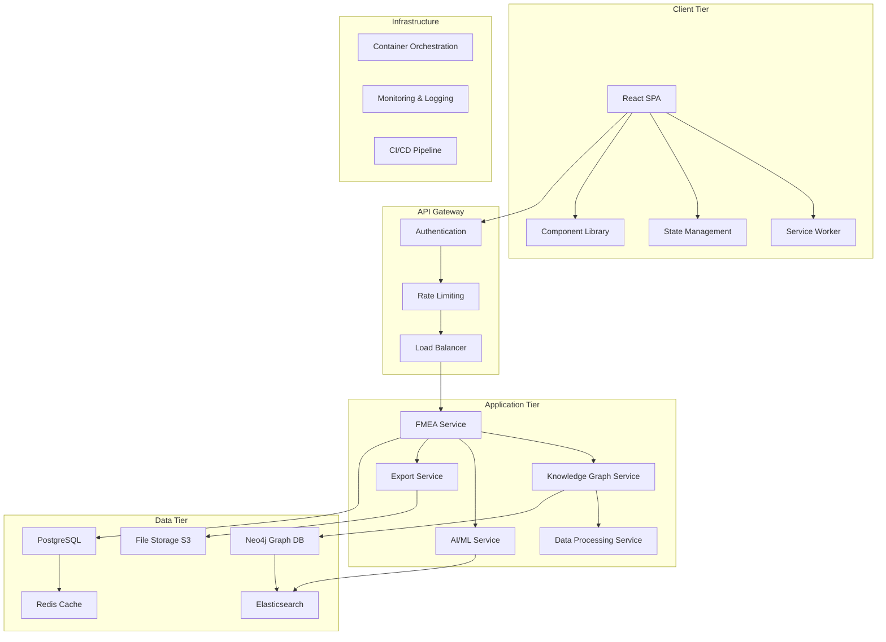
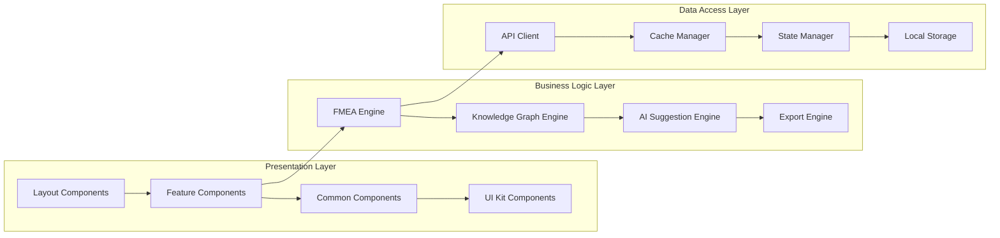
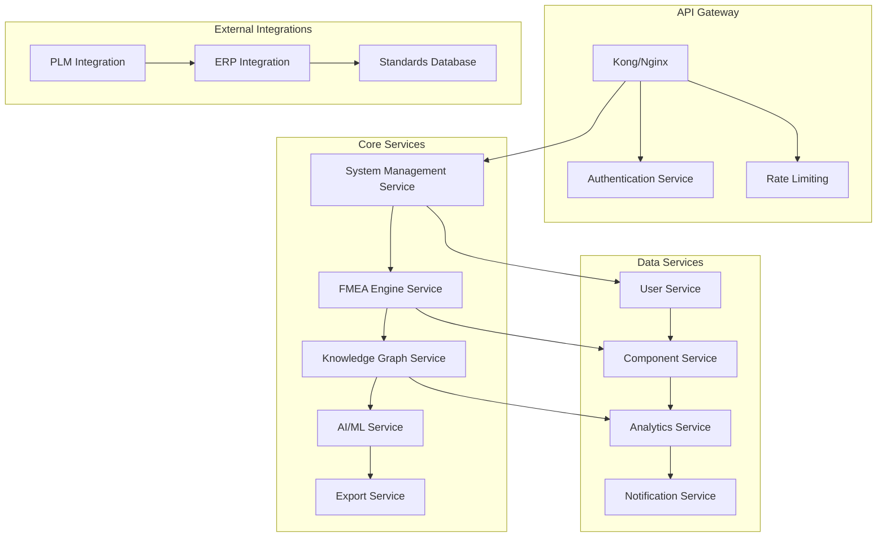

# FMEA Copilot - Production Architecture Design

## Executive Summary

This document provides a comprehensive architectural design for optimizing the existing FMEA Copilot React application for production deployment. The design addresses scalability, performance, security, and maintainability requirements for an enterprise-grade automotive failure analysis platform.

## 1. Current Architecture Analysis

### 1.1 Existing Strengths
- **Modern React Stack**: React 18.2.0 with Material-UI v5.14+ provides solid foundation
- **Rich Data Visualization**: Recharts and D3.js integration for analytics
- **Knowledge Graph Capabilities**: Cytoscape.js for complex relationship visualization
- **Comprehensive FMEA Workflow**: Complete step-by-step process implementation
- **Real Automotive Data**: Authentic component database with failure modes
- **AI Integration**: Intelligent failure mode suggestions

### 1.2 Identified Optimization Opportunities
- **State Management**: Currently using local component state, needs centralized solution
- **Bundle Size**: Multiple heavy dependencies (D3.js, Cytoscape.js) need optimization
- **Data Architecture**: In-memory data needs persistent backend integration
- **Performance**: Large datasets require virtualization and lazy loading
- **Security**: No authentication or authorization layer
- **Scalability**: Single-page application needs microservice architecture
- **Testing**: Missing comprehensive test coverage
- **Deployment**: No CI/CD pipeline or containerization

## 2. Production Architecture Design

### 2.1 High-Level Architecture



### 2.2 Component Architecture



## 3. Optimized Project Structure

### 3.1 Frontend Architecture

```
fmea-copilot/
├── public/
│   ├── index.html
│   ├── manifest.json
│   └── service-worker.js
├── src/
│   ├── components/
│   │   ├── common/           # Reusable UI components
│   │   │   ├── DataTable/
│   │   │   ├── Charts/
│   │   │   ├── Forms/
│   │   │   └── Navigation/
│   │   ├── features/         # Feature-specific components
│   │   │   ├── SystemInput/
│   │   │   ├── KnowledgeExplorer/
│   │   │   ├── FMEABuilder/
│   │   │   └── ResultsViewer/
│   │   └── layout/           # Layout components
│   │       ├── Header/
│   │       ├── Sidebar/
│   │       └── Footer/
│   ├── services/             # Business logic services
│   │   ├── api/              # API integration
│   │   ├── fmea/             # FMEA engine
│   │   ├── knowledge/        # Knowledge graph service
│   │   ├── ai/               # AI suggestion service
│   │   └── export/           # Export functionality
│   ├── store/                # State management
│   │   ├── slices/           # Redux Toolkit slices
│   │   ├── middleware/       # Custom middleware
│   │   └── selectors/        # Reselect selectors
│   ├── hooks/                # Custom React hooks
│   ├── utils/                # Utility functions
│   ├── types/                # TypeScript definitions
│   ├── constants/            # Application constants
│   ├── assets/               # Static assets
│   └── styles/               # Global styles
├── tests/                    # Test files
│   ├── __mocks__/
│   ├── components/
│   ├── services/
│   └── utils/
├── docs/                     # Documentation
├── scripts/                  # Build and deployment scripts
└── config/                   # Configuration files
```

### 3.2 Backend Architecture

```
fmea-api/
├── src/
│   ├── controllers/          # Request handlers
│   ├── services/             # Business logic
│   ├── models/               # Data models
│   ├── middleware/           # Express middleware
│   ├── routes/               # API routes
│   ├── utils/                # Utility functions
│   ├── config/               # Configuration
│   └── types/                # TypeScript definitions
├── tests/                    # Test files
├── migrations/               # Database migrations
├── seeds/                    # Database seeds
└── docs/                     # API documentation
```

## 4. Data Models and State Management

### 4.1 Core Data Models

```typescript
// System Model
interface SystemModel {
  id: string;
  name: string;
  type: SystemType;
  description: string;
  vehicleApplication: VehicleType;
  primaryObjective: string;
  operatingConditions: OperatingConditions;
  safetyClassification: ASILLevel;
  components: ComponentModel[];
  interfaces: SystemInterface[];
  createdAt: Date;
  updatedAt: Date;
  version: number;
}

// Component Model
interface ComponentModel {
  id: string;
  label: string;
  type: ComponentType;
  manufacturer: string;
  partNumber: string;
  description: string;
  specifications: ComponentSpecifications;
  reliability: ReliabilityData;
  suppliers: string[];
  cost: CostData;
  relationships: ComponentRelationship[];
}

// FMEA Entry Model
interface FMEAEntry {
  id: string;
  systemId: string;
  item: string;
  function: string;
  failureMode: string;
  effects: FailureEffects;
  severity: number;
  classification: FailureClassification;
  causes: string[];
  occurrence: number;
  currentControls: string[];
  detection: number;
  rpn: number;
  recommendedActions: RecommendedAction[];
  responsibility: string;
  targetDate: Date;
  actionsTaken: string;
  confidence: number;
  source: DataSource;
}

// Knowledge Graph Node
interface KnowledgeNode {
  id: string;
  type: NodeType;
  properties: Record<string, any>;
  relationships: KnowledgeRelationship[];
  metadata: NodeMetadata;
}
```

### 4.2 State Management Architecture

```typescript
// Redux Store Structure
interface RootState {
  auth: AuthState;
  system: SystemState;
  fmea: FMEAState;
  knowledge: KnowledgeState;
  ui: UIState;
  cache: CacheState;
}

// System State Slice
interface SystemState {
  current: SystemModel | null;
  list: SystemModel[];
  loading: boolean;
  error: string | null;
  filters: SystemFilters;
  pagination: PaginationState;
}

// FMEA State Slice
interface FMEAState {
  entries: FMEAEntry[];
  currentEntry: FMEAEntry | null;
  analysis: FMEAAnalysis;
  workflow: WorkflowState;
  validation: ValidationState;
}
```

## 5. API Architecture and Backend Integration

### 5.1 RESTful API Design

```typescript
// API Endpoints Structure
const API_ENDPOINTS = {
  // Authentication
  auth: {
    login: 'POST /api/v1/auth/login',
    logout: 'POST /api/v1/auth/logout',
    refresh: 'POST /api/v1/auth/refresh',
    profile: 'GET /api/v1/auth/profile'
  },
  
  // Systems Management
  systems: {
    list: 'GET /api/v1/systems',
    create: 'POST /api/v1/systems',
    get: 'GET /api/v1/systems/:id',
    update: 'PUT /api/v1/systems/:id',
    delete: 'DELETE /api/v1/systems/:id'
  },
  
  // FMEA Operations
  fmea: {
    generate: 'POST /api/v1/fmea/generate',
    entries: 'GET /api/v1/fmea/:systemId/entries',
    entry: {
      create: 'POST /api/v1/fmea/:systemId/entries',
      update: 'PUT /api/v1/fmea/entries/:id',
      delete: 'DELETE /api/v1/fmea/entries/:id'
    },
    export: 'POST /api/v1/fmea/:systemId/export'
  },
  
  // Knowledge Graph
  knowledge: {
    components: 'GET /api/v1/knowledge/components',
    search: 'GET /api/v1/knowledge/search',
    suggestions: 'POST /api/v1/knowledge/suggestions',
    graph: 'GET /api/v1/knowledge/graph/:systemId'
  },
  
  // AI Services
  ai: {
    analyze: 'POST /api/v1/ai/analyze',
    suggestions: 'POST /api/v1/ai/suggestions',
    confidence: 'POST /api/v1/ai/confidence'
  }
};
```

### 5.2 Microservices Architecture



## 6. Performance Optimization Strategy

### 6.1 Bundle Size Optimization

```typescript
// Webpack Configuration Optimizations
const webpackConfig = {
  optimization: {
    splitChunks: {
      chunks: 'all',
      cacheGroups: {
        vendor: {
          test: /[\\/]node_modules[\\/]/,
          name: 'vendors',
          chunks: 'all',
        },
        mui: {
          test: /[\\/]node_modules[\\/]@mui[\\/]/,
          name: 'mui',
          chunks: 'all',
        },
        charts: {
          test: /[\\/]node_modules[\\/](recharts|d3|cytoscape)[\\/]/,
          name: 'charts',
          chunks: 'all',
        }
      }
    }
  }
};

// Dynamic Imports for Code Splitting
const KnowledgeExplorer = lazy(() => import('./components/features/KnowledgeExplorer'));
const FMEABuilder = lazy(() => import('./components/features/FMEABuilder'));
const ResultsViewer = lazy(() => import('./components/features/ResultsViewer'));
```

### 6.2 Data Virtualization

```typescript
// Virtual Table Implementation
interface VirtualTableProps {
  data: FMEAEntry[];
  height: number;
  rowHeight: number;
  overscan?: number;
}

const VirtualFMEATable: React.FC<VirtualTableProps> = ({
  data,
  height,
  rowHeight,
  overscan = 5
}) => {
  const [scrollTop, setScrollTop] = useState(0);
  
  const visibleStart = Math.floor(scrollTop / rowHeight);
  const visibleEnd = Math.min(
    visibleStart + Math.ceil(height / rowHeight) + overscan,
    data.length
  );
  
  const visibleItems = data.slice(visibleStart, visibleEnd);
  
  return (
    <div style={{ height, overflow: 'auto' }}>
      {/* Virtual scrolling implementation */}
    </div>
  );
};
```

### 6.3 Caching Strategy

```typescript
// Multi-level Caching Architecture
interface CacheStrategy {
  browser: {
    localStorage: 'user preferences, session data';
    sessionStorage: 'temporary workflow data';
    indexedDB: 'large datasets, offline support';
  };
  
  application: {
    redux: 'application state';
    reactQuery: 'server state management';
    serviceWorker: 'network request caching';
  };
  
  server: {
    redis: 'session data, frequent queries';
    cdn: 'static assets, images';
    database: 'query result caching';
  };
}
```

## 7. Security Architecture

### 7.1 Authentication and Authorization

```typescript
// JWT-based Authentication
interface AuthenticationFlow {
  login: {
    method: 'OAuth 2.0 / SAML / LDAP';
    tokens: {
      access: 'short-lived (15 minutes)';
      refresh: 'long-lived (7 days)';
    };
    storage: 'httpOnly cookies + secure headers';
  };
  
  authorization: {
    rbac: 'Role-Based Access Control';
    permissions: 'granular feature permissions';
    dataAccess: 'row-level security';
  };
}

// Security Middleware
const securityMiddleware = {
  helmet: 'security headers',
  cors: 'cross-origin resource sharing',
  rateLimit: 'request rate limiting',
  validation: 'input sanitization',
  encryption: 'data encryption at rest/transit'
};
```

### 7.2 Data Protection

```typescript
// Data Classification and Protection
interface DataSecurity {
  classification: {
    public: 'general system information';
    internal: 'company-specific FMEA data';
    confidential: 'proprietary failure analysis';
    restricted: 'safety-critical assessments';
  };
  
  protection: {
    encryption: 'AES-256 for data at rest';
    transmission: 'TLS 1.3 for data in transit';
    backup: 'encrypted automated backups';
    audit: 'comprehensive audit logging';
  };
}
```

## 8. Deployment Architecture

### 8.1 Containerization Strategy

```dockerfile
# Multi-stage Docker Build
FROM node:18-alpine AS builder
WORKDIR /app
COPY package*.json ./
RUN npm ci --only=production

FROM node:18-alpine AS runtime
WORKDIR /app
COPY --from=builder /app/node_modules ./node_modules
COPY . .
EXPOSE 3000
CMD ["npm", "start"]
```

### 8.2 Kubernetes Deployment

```yaml
# Kubernetes Deployment Configuration
apiVersion: apps/v1
kind: Deployment
metadata:
  name: fmea-copilot-frontend
spec:
  replicas: 3
  selector:
    matchLabels:
      app: fmea-copilot-frontend
  template:
    metadata:
      labels:
        app: fmea-copilot-frontend
    spec:
      containers:
      - name: frontend
        image: fmea-copilot:latest
        ports:
        - containerPort: 3000
        resources:
          requests:
            memory: "256Mi"
            cpu: "250m"
          limits:
            memory: "512Mi"
            cpu: "500m"
```

### 8.3 Infrastructure as Code

```terraform
# Terraform Configuration
resource "aws_ecs_cluster" "fmea_cluster" {
  name = "fmea-copilot-cluster"
  
  setting {
    name  = "containerInsights"
    value = "enabled"
  }
}

resource "aws_ecs_service" "fmea_frontend" {
  name            = "fmea-frontend"
  cluster         = aws_ecs_cluster.fmea_cluster.id
  task_definition = aws_ecs_task_definition.fmea_frontend.arn
  desired_count   = 3
  
  load_balancer {
    target_group_arn = aws_lb_target_group.fmea_frontend.arn
    container_name   = "frontend"
    container_port   = 3000
  }
}
```

## 9. Monitoring and Observability

### 9.1 Application Performance Monitoring

```typescript
// Performance Monitoring Setup
interface MonitoringStack {
  metrics: {
    application: 'Prometheus + Grafana';
    infrastructure: 'CloudWatch / DataDog';
    userExperience: 'Google Analytics + Hotjar';
  };
  
  logging: {
    application: 'Winston + ELK Stack';
    infrastructure: 'Fluentd + Elasticsearch';
    security: 'SIEM integration';
  };
  
  tracing: {
    distributed: 'Jaeger / Zipkin';
    frontend: 'Sentry error tracking';
    performance: 'Web Vitals monitoring';
  };
}
```

### 9.2 Health Checks and Alerting

```typescript
// Health Check Implementation
const healthChecks = {
  frontend: {
    endpoint: '/health',
    checks: ['bundle loading', 'API connectivity', 'localStorage access']
  },
  
  backend: {
    endpoint: '/api/health',
    checks: ['database connection', 'external services', 'memory usage']
  },
  
  alerts: {
    errorRate: 'threshold > 1%',
    responseTime: 'p95 > 2 seconds',
    availability: 'uptime < 99.9%'
  }
};
```

## 10. Implementation Phases and Migration Roadmap

### Phase 1: Foundation (Weeks 1-4)
- **Week 1-2**: Infrastructure setup and CI/CD pipeline
- **Week 3-4**: Backend API development and database design

### Phase 2: Core Features (Weeks 5-8)
- **Week 5-6**: Authentication and user management
- **Week 7-8**: System management and FMEA engine optimization

### Phase 3: Advanced Features (Weeks 9-12)
- **Week 9-10**: Knowledge graph integration and AI services
- **Week 11-12**: Export functionality and reporting

### Phase 4: Production Readiness (Weeks 13-16)
- **Week 13-14**: Performance optimization and security hardening
- **Week 15-16**: Testing, monitoring, and deployment

### Phase 5: Enterprise Integration (Weeks 17-20)
- **Week 17-18**: PLM/ERP integration
- **Week 19-20**: Advanced analytics and compliance features

## 11. Technical Specifications

### 11.1 Performance Requirements
- **Page Load Time**: < 2 seconds initial load
- **Bundle Size**: < 1MB gzipped main bundle
- **Memory Usage**: < 100MB peak memory
- **Concurrent Users**: Support 1000+ concurrent users
- **API Response Time**: < 500ms for 95th percentile

### 11.2 Browser Support
- **Modern Browsers**: Chrome 90+, Firefox 88+, Safari 14+, Edge 90+
- **Mobile Support**: iOS Safari 14+, Chrome Mobile 90+
- **Progressive Web App**: Offline functionality for core features

### 11.3 Accessibility Requirements
- **WCAG 2.1 AA Compliance**: Full accessibility support
- **Keyboard Navigation**: Complete keyboard accessibility
- **Screen Reader Support**: ARIA labels and semantic HTML
- **Color Contrast**: Minimum 4.5:1 contrast ratio

## 12. Risk Assessment and Mitigation

### 12.1 Technical Risks
- **Bundle Size Growth**: Implement strict bundle analysis and code splitting
- **Performance Degradation**: Continuous performance monitoring and optimization
- **Security Vulnerabilities**: Regular security audits and dependency updates
- **Data Loss**: Comprehensive backup and disaster recovery procedures

### 12.2 Business Risks
- **User Adoption**: Comprehensive training and change management
- **Integration Complexity**: Phased integration approach with fallback options
- **Compliance Issues**: Regular compliance audits and documentation
- **Scalability Challenges**: Cloud-native architecture with auto-scaling

## Conclusion

This architectural design provides a comprehensive roadmap for transforming the existing FMEA Copilot prototype into a production-ready, enterprise-grade application. The design emphasizes scalability, performance, security, and maintainability while preserving the innovative features that make the application valuable for automotive failure analysis.

The phased implementation approach ensures minimal disruption to existing functionality while systematically improving the architecture for production deployment. Regular reviews and adjustments should be made based on user feedback and changing requirements.