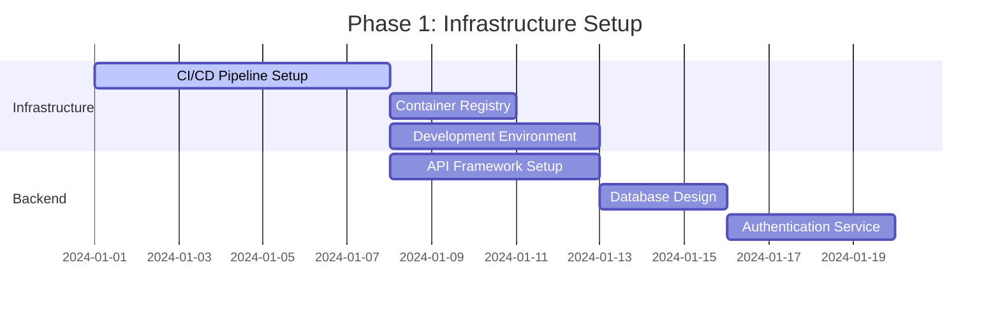
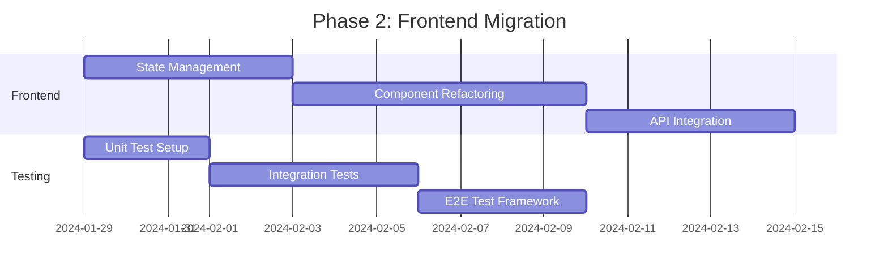
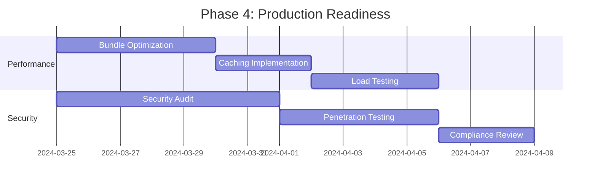
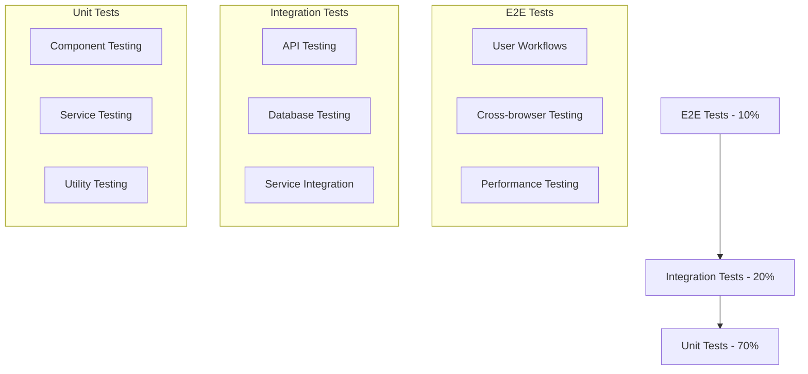
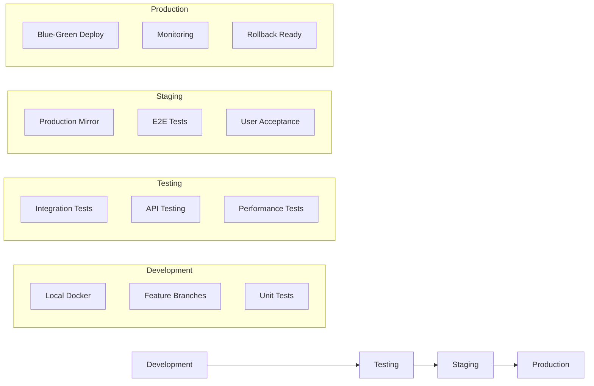

# FMEA Copilot - Implementation Roadmap & Migration Strategy

## 1. Migration Strategy Overview

### 1.1 Current State Assessment
- **Existing Codebase**: React prototype with Material-UI components
- **Data Storage**: In-memory JavaScript objects and static data files
- **Architecture**: Single-page application with local state management
- **Deployment**: Development environment only
- **Testing**: Limited or no automated testing

### 1.2 Target State Vision
- **Production-Ready Application**: Scalable, secure, and maintainable
- **Enterprise Integration**: PLM/ERP system connectivity
- **Multi-User Collaboration**: Real-time collaborative editing
- **Advanced Analytics**: AI-powered insights and recommendations
- **Compliance Ready**: Industry standards and audit trails

## 2. Implementation Phases

### Phase 1: Foundation & Infrastructure (Weeks 1-4)

#### Week 1-2: Infrastructure Setup


**Deliverables:**
- [ ] Docker containerization for all services
- [ ] Kubernetes cluster setup (development)
- [ ] CI/CD pipeline with GitHub Actions
- [ ] PostgreSQL and Neo4j database setup
- [ ] Redis caching layer
- [ ] Basic monitoring and logging

**Technical Tasks:**
```bash
# Infrastructure as Code
terraform init
terraform plan -var-file="dev.tfvars"
terraform apply

# Container Setup
docker build -t fmea-copilot:dev .
docker-compose up -d

# Database Migration
npm run db:migrate
npm run db:seed
```

#### Week 3-4: Backend API Development
**Deliverables:**
- [ ] RESTful API with OpenAPI documentation
- [ ] GraphQL endpoint for complex queries
- [ ] JWT-based authentication system
- [ ] Role-based access control (RBAC)
- [ ] Input validation and sanitization
- [ ] Error handling and logging

**API Endpoints Priority:**
1. Authentication (`/api/v1/auth/*`)
2. User Management (`/api/v1/users/*`)
3. System Management (`/api/v1/systems/*`)
4. Component Library (`/api/v1/components/*`)

### Phase 2: Core Application Migration (Weeks 5-8)

#### Week 5-6: Frontend Architecture Upgrade


**Migration Tasks:**
- [ ] Implement Redux Toolkit for state management
- [ ] Refactor components to use TypeScript
- [ ] Replace local data with API calls
- [ ] Implement React Query for server state
- [ ] Add comprehensive error boundaries
- [ ] Implement loading states and optimistic updates

**Code Migration Example:**
```typescript
// Before: Local state management
const [systemData, setSystemData] = useState(null);

// After: Redux Toolkit + React Query
const { data: systemData, isLoading, error } = useGetSystemQuery(systemId);
const dispatch = useAppDispatch();
```

#### Week 7-8: FMEA Engine Enhancement
**Deliverables:**
- [ ] Database-backed FMEA storage
- [ ] Real-time collaboration features
- [ ] Advanced validation engine
- [ ] Bulk operations support
- [ ] Version control for FMEA documents
- [ ] Audit trail implementation

### Phase 3: Advanced Features (Weeks 9-12)

#### Week 9-10: Knowledge Graph Integration
**Deliverables:**
- [ ] Neo4j knowledge graph implementation
- [ ] Component relationship mapping
- [ ] Historical failure analysis
- [ ] AI-powered suggestions enhancement
- [ ] Confidence scoring algorithms
- [ ] Knowledge graph visualization

**Knowledge Graph Migration:**
```cypher
// Migrate existing component data to Neo4j
LOAD CSV WITH HEADERS FROM 'file:///components.csv' AS row
CREATE (c:Component {
  id: row.id,
  label: row.label,
  type: row.type,
  manufacturer: row.manufacturer,
  specifications: apoc.convert.fromJsonMap(row.specifications)
});

// Create relationships
LOAD CSV WITH HEADERS FROM 'file:///relationships.csv' AS row
MATCH (from:Component {id: row.from_id})
MATCH (to:Component {id: row.to_id})
CREATE (from)-[:CONNECTS_TO {
  type: row.connection_type,
  specifications: apoc.convert.fromJsonMap(row.specs)
}]->(to);
```

#### Week 11-12: AI/ML Services
**Deliverables:**
- [ ] Machine learning model for failure prediction
- [ ] Natural language processing for system descriptions
- [ ] Automated risk assessment
- [ ] Recommendation engine
- [ ] Confidence scoring system
- [ ] Model training pipeline

### Phase 4: Production Readiness (Weeks 13-16)

#### Week 13-14: Performance & Security


**Performance Optimization:**
- [ ] Code splitting and lazy loading
- [ ] Bundle size optimization (target: <1MB gzipped)
- [ ] Virtual scrolling for large datasets
- [ ] Service worker implementation
- [ ] CDN setup for static assets
- [ ] Database query optimization

**Security Hardening:**
- [ ] OWASP security checklist compliance
- [ ] Dependency vulnerability scanning
- [ ] Input validation and sanitization
- [ ] Rate limiting and DDoS protection
- [ ] Data encryption at rest and in transit
- [ ] Security headers implementation

#### Week 15-16: Deployment & Monitoring
**Deliverables:**
- [ ] Production Kubernetes cluster
- [ ] Blue-green deployment strategy
- [ ] Comprehensive monitoring dashboard
- [ ] Alerting and notification system
- [ ] Backup and disaster recovery
- [ ] Performance monitoring

### Phase 5: Enterprise Integration (Weeks 17-20)

#### Week 17-18: External System Integration
**Integration Targets:**
- [ ] PLM system integration (Siemens Teamcenter, PTC Windchill)
- [ ] ERP system connectivity (SAP, Oracle)
- [ ] Standards databases (ISO 26262, FMVSS)
- [ ] Document management systems
- [ ] Single Sign-On (SSO) integration
- [ ] API gateway implementation

#### Week 19-20: Advanced Analytics & Reporting
**Deliverables:**
- [ ] Advanced analytics dashboard
- [ ] Custom report builder
- [ ] Automated compliance reporting
- [ ] Trend analysis and predictions
- [ ] Executive summary generation
- [ ] Mobile application support

## 3. Risk Mitigation Strategies

### 3.1 Technical Risks

| Risk | Impact | Probability | Mitigation Strategy |
|------|--------|-------------|-------------------|
| Performance degradation with large datasets | High | Medium | Implement virtual scrolling, pagination, and caching |
| Bundle size exceeding limits | Medium | High | Code splitting, tree shaking, and dependency optimization |
| Database migration issues | High | Low | Comprehensive testing, rollback procedures |
| Third-party integration failures | Medium | Medium | Fallback mechanisms, circuit breakers |
| Security vulnerabilities | High | Medium | Regular audits, automated scanning, security training |

### 3.2 Business Risks

| Risk | Impact | Probability | Mitigation Strategy |
|------|--------|-------------|-------------------|
| User adoption resistance | High | Medium | Training programs, gradual rollout, user feedback |
| Compliance requirements changes | Medium | Low | Flexible architecture, regular compliance reviews |
| Competitive pressure | Medium | High | Rapid feature development, unique value proposition |
| Budget overruns | High | Medium | Agile development, regular budget reviews |

## 4. Testing Strategy

### 4.1 Testing Pyramid



### 4.2 Testing Implementation Schedule

**Phase 1 Testing (Weeks 1-4):**
- [ ] Unit tests for backend services (80% coverage)
- [ ] API integration tests
- [ ] Database migration tests
- [ ] Infrastructure smoke tests

**Phase 2 Testing (Weeks 5-8):**
- [ ] React component unit tests (90% coverage)
- [ ] Redux store testing
- [ ] API client testing
- [ ] Cross-browser compatibility tests

**Phase 3 Testing (Weeks 9-12):**
- [ ] Knowledge graph query tests
- [ ] AI/ML model validation tests
- [ ] Performance benchmarking
- [ ] Load testing (1000+ concurrent users)

**Phase 4 Testing (Weeks 13-16):**
- [ ] Security penetration testing
- [ ] End-to-end user workflow tests
- [ ] Disaster recovery testing
- [ ] Production environment validation

## 5. Deployment Strategy

### 5.1 Environment Progression



### 5.2 Deployment Automation

```yaml
# GitHub Actions Workflow
name: Deploy to Production
on:
  push:
    branches: [main]

jobs:
  test:
    runs-on: ubuntu-latest
    steps:
      - uses: actions/checkout@v3
      - name: Run Tests
        run: |
          npm ci
          npm run test:unit
          npm run test:integration
          npm run test:e2e

  build:
    needs: test
    runs-on: ubuntu-latest
    steps:
      - name: Build Docker Image
        run: |
          docker build -t fmea-copilot:${{ github.sha }} .
          docker push registry.company.com/fmea-copilot:${{ github.sha }}

  deploy:
    needs: build
    runs-on: ubuntu-latest
    steps:
      - name: Deploy to Kubernetes
        run: |
          kubectl set image deployment/fmea-copilot \
            fmea-copilot=registry.company.com/fmea-copilot:${{ github.sha }}
          kubectl rollout status deployment/fmea-copilot
```

## 6. Success Metrics and KPIs

### 6.1 Technical Metrics

| Metric | Target | Measurement |
|--------|--------|-------------|
| Page Load Time | < 2 seconds | Lighthouse, Web Vitals |
| Bundle Size | < 1MB gzipped | Webpack Bundle Analyzer |
| Test Coverage | > 85% | Jest, Cypress |
| API Response Time | < 500ms (95th percentile) | Application monitoring |
| Uptime | > 99.9% | Infrastructure monitoring |
| Security Score | A+ | OWASP ZAP, Snyk |

### 6.2 Business Metrics

| Metric | Target | Measurement |
|--------|--------|-------------|
| User Adoption Rate | > 80% within 6 months | Analytics |
| Time to Complete FMEA | < 50% of manual process | User tracking |
| Error Reduction | > 30% fewer FMEA errors | Quality metrics |
| User Satisfaction | > 4.5/5 rating | User surveys |
| Training Time | < 4 hours to proficiency | Training metrics |

## 7. Change Management Strategy

### 7.1 User Training Program

**Phase 1: Early Adopters (Week 14-15)**
- [ ] Identify power users and champions
- [ ] Intensive training sessions (8 hours)
- [ ] Feedback collection and iteration
- [ ] Documentation refinement

**Phase 2: Department Rollout (Week 16-17)**
- [ ] Department-by-department training
- [ ] Hands-on workshops (4 hours)
- [ ] Peer mentoring program
- [ ] Support ticket system

**Phase 3: Organization-wide (Week 18-20)**
- [ ] Self-paced online training
- [ ] Video tutorials and documentation
- [ ] Regular office hours for support
- [ ] Continuous improvement feedback

### 7.2 Communication Plan

| Stakeholder | Frequency | Method | Content |
|-------------|-----------|--------|---------|
| Executive Team | Weekly | Email Report | Progress, risks, budget |
| Department Heads | Bi-weekly | Presentation | Features, timeline, training |
| End Users | Weekly | Newsletter | Tips, updates, success stories |
| IT Team | Daily | Slack/Teams | Technical updates, issues |

## 8. Post-Launch Support

### 8.1 Support Structure

**Tier 1: User Support**
- [ ] Help desk for basic questions
- [ ] Documentation and FAQ
- [ ] Video tutorials
- [ ] Community forum

**Tier 2: Technical Support**
- [ ] Application specialists
- [ ] Bug triage and resolution
- [ ] Performance optimization
- [ ] Integration support

**Tier 3: Development Team**
- [ ] Complex bug fixes
- [ ] Feature enhancements
- [ ] Architecture changes
- [ ] Emergency response

### 8.2 Continuous Improvement

**Monthly Reviews:**
- [ ] Performance metrics analysis
- [ ] User feedback assessment
- [ ] Security vulnerability scanning
- [ ] Dependency updates

**Quarterly Enhancements:**
- [ ] Feature roadmap updates
- [ ] User experience improvements
- [ ] Performance optimizations
- [ ] Integration expansions

**Annual Assessments:**
- [ ] Architecture review
- [ ] Technology stack evaluation
- [ ] Compliance audit
- [ ] Strategic planning

## 9. Budget and Resource Planning

### 9.1 Development Team Structure

| Role | Phase 1-2 | Phase 3-4 | Phase 5 | Post-Launch |
|------|-----------|-----------|---------|-------------|
| Tech Lead | 1 | 1 | 1 | 0.5 |
| Frontend Developers | 2 | 3 | 2 | 1 |
| Backend Developers | 2 | 2 | 3 | 1 |
| DevOps Engineer | 1 | 1 | 1 | 0.5 |
| QA Engineers | 1 | 2 | 2 | 1 |
| UX/UI Designer | 1 | 1 | 0.5 | 0.25 |
| Product Manager | 1 | 1 | 1 | 0.5 |

### 9.2 Infrastructure Costs (Monthly)

| Service | Development | Staging | Production |
|---------|-------------|---------|------------|
| Kubernetes Cluster | $500 | $1,000 | $3,000 |
| Database (PostgreSQL) | $200 | $400 | $1,200 |
| Graph Database (Neo4j) | $300 | $600 | $1,800 |
| Cache (Redis) | $100 | $200 | $600 |
| CDN | $50 | $100 | $300 |
| Monitoring | $100 | $200 | $500 |
| **Total** | **$1,250** | **$2,500** | **$7,400** |

## 10. Conclusion

This implementation roadmap provides a comprehensive strategy for migrating the FMEA Copilot prototype to a production-ready, enterprise-grade application. The phased approach ensures minimal risk while delivering value incrementally.

Key success factors:
- **Strong technical foundation** with modern architecture patterns
- **Comprehensive testing strategy** ensuring quality and reliability
- **Gradual user adoption** with proper training and support
- **Continuous monitoring and improvement** for long-term success
- **Flexible architecture** supporting future enhancements and integrations

The 20-week timeline balances speed of delivery with quality assurance, providing a solid foundation for the application's long-term success in the automotive industry.