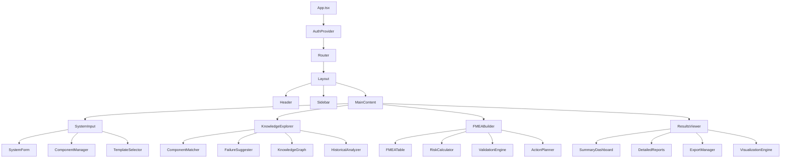
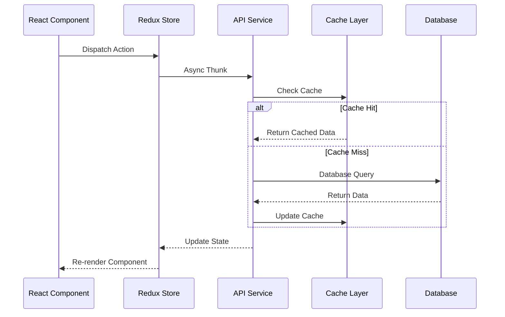
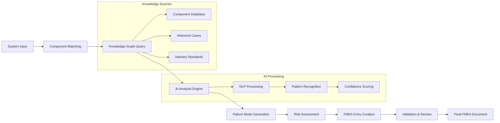
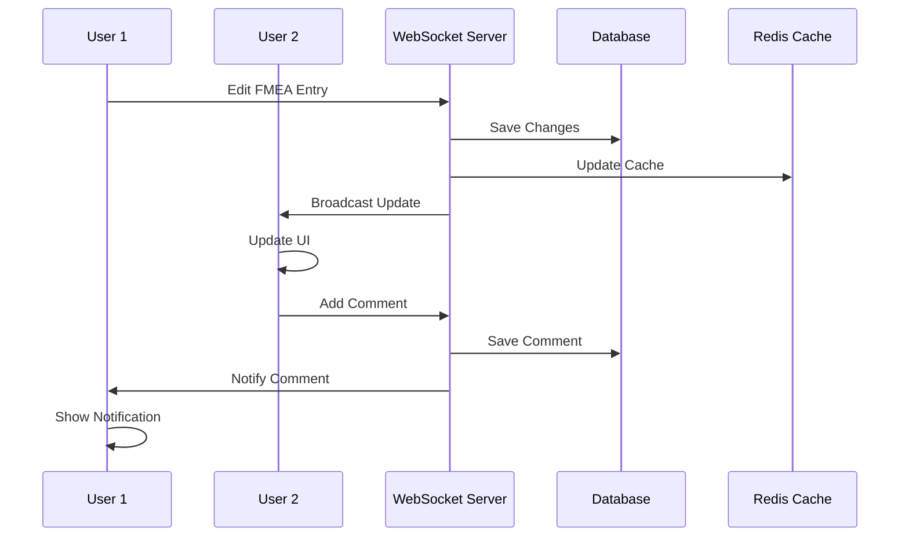

# FMEA Copilot - Technical Implementation Specifications

## 1. Detailed Component Architecture

### 1.1 Frontend Component Hierarchy



### 1.2 State Management Flow



## 2. Data Flow Architecture

### 2.1 FMEA Generation Pipeline



### 2.2 Real-time Collaboration Flow



## 3. Performance Optimization Implementation

### 3.1 Code Splitting Strategy

```typescript
// Route-based Code Splitting
const SystemInputPage = lazy(() => 
  import('./pages/SystemInput').then(module => ({
    default: module.SystemInputPage
  }))
);

const KnowledgeExplorerPage = lazy(() => 
  import('./pages/KnowledgeExplorer').then(module => ({
    default: module.KnowledgeExplorerPage
  }))
);

// Component-based Code Splitting
const HeavyVisualization = lazy(() => 
  import('./components/HeavyVisualization').then(module => ({
    default: module.HeavyVisualization
  }))
);

// Dynamic Import with Error Boundary
const LazyComponent: React.FC = () => (
  <Suspense fallback={<LoadingSpinner />}>
    <ErrorBoundary>
      <HeavyVisualization />
    </ErrorBoundary>
  </Suspense>
);
```

### 3.2 Memory Management

```typescript
// Virtual Scrolling Implementation
interface VirtualScrollProps {
  items: any[];
  itemHeight: number;
  containerHeight: number;
  renderItem: (item: any, index: number) => React.ReactNode;
}

const VirtualScroll: React.FC<VirtualScrollProps> = ({
  items,
  itemHeight,
  containerHeight,
  renderItem
}) => {
  const [scrollTop, setScrollTop] = useState(0);
  
  const startIndex = Math.floor(scrollTop / itemHeight);
  const endIndex = Math.min(
    startIndex + Math.ceil(containerHeight / itemHeight) + 1,
    items.length
  );
  
  const visibleItems = items.slice(startIndex, endIndex);
  
  return (
    <div
      style={{ height: containerHeight, overflow: 'auto' }}
      onScroll={(e) => setScrollTop(e.currentTarget.scrollTop)}
    >
      <div style={{ height: items.length * itemHeight, position: 'relative' }}>
        {visibleItems.map((item, index) => (
          <div
            key={startIndex + index}
            style={{
              position: 'absolute',
              top: (startIndex + index) * itemHeight,
              height: itemHeight,
              width: '100%'
            }}
          >
            {renderItem(item, startIndex + index)}
          </div>
        ))}
      </div>
    </div>
  );
};
```

### 3.3 Caching Implementation

```typescript
// React Query Configuration
const queryClient = new QueryClient({
  defaultOptions: {
    queries: {
      staleTime: 5 * 60 * 1000, // 5 minutes
      cacheTime: 10 * 60 * 1000, // 10 minutes
      retry: 3,
      retryDelay: attemptIndex => Math.min(1000 * 2 ** attemptIndex, 30000),
    },
  },
});

// Custom Hook with Caching
const useFMEAData = (systemId: string) => {
  return useQuery({
    queryKey: ['fmea', systemId],
    queryFn: () => fmeaService.getFMEAData(systemId),
    enabled: !!systemId,
    staleTime: 2 * 60 * 1000, // 2 minutes for FMEA data
  });
};

// Service Worker Caching
self.addEventListener('fetch', (event) => {
  if (event.request.url.includes('/api/')) {
    event.respondWith(
      caches.open('api-cache').then(cache => {
        return cache.match(event.request).then(response => {
          if (response) {
            // Serve from cache
            fetch(event.request).then(fetchResponse => {
              cache.put(event.request, fetchResponse.clone());
            });
            return response;
          }
          // Fetch and cache
          return fetch(event.request).then(fetchResponse => {
            cache.put(event.request, fetchResponse.clone());
            return fetchResponse;
          });
        });
      })
    );
  }
});
```

## 4. Security Implementation

### 4.1 Authentication Flow

```typescript
// JWT Token Management
class AuthService {
  private accessToken: string | null = null;
  private refreshToken: string | null = null;
  
  async login(credentials: LoginCredentials): Promise<AuthResponse> {
    const response = await api.post('/auth/login', credentials);
    
    this.setTokens(response.data.accessToken, response.data.refreshToken);
    this.scheduleTokenRefresh();
    
    return response.data;
  }
  
  private setTokens(accessToken: string, refreshToken: string) {
    this.accessToken = accessToken;
    this.refreshToken = refreshToken;
    
    // Store refresh token in httpOnly cookie (handled by server)
    // Access token kept in memory only
  }
  
  private scheduleTokenRefresh() {
    const tokenPayload = this.decodeToken(this.accessToken!);
    const expirationTime = tokenPayload.exp * 1000;
    const refreshTime = expirationTime - Date.now() - 60000; // 1 minute before expiry
    
    setTimeout(() => {
      this.refreshAccessToken();
    }, refreshTime);
  }
  
  async refreshAccessToken(): Promise<void> {
    try {
      const response = await api.post('/auth/refresh');
      this.setTokens(response.data.accessToken, this.refreshToken!);
      this.scheduleTokenRefresh();
    } catch (error) {
      this.logout();
      throw error;
    }
  }
}
```

### 4.2 Input Validation and Sanitization

```typescript
// Zod Schema Validation
const SystemInputSchema = z.object({
  systemName: z.string().min(1).max(100).regex(/^[a-zA-Z0-9\s\-_]+$/),
  systemType: z.enum(['brake_system', 'powertrain', 'steering_system']),
  description: z.string().min(10).max(1000),
  components: z.array(z.string().min(1).max(50)).min(1).max(20),
  safetyClassification: z.enum(['ASIL_A', 'ASIL_B', 'ASIL_C', 'ASIL_D', 'QM'])
});

// Input Sanitization Middleware
const sanitizeInput = (req: Request, res: Response, next: NextFunction) => {
  const sanitize = (obj: any): any => {
    if (typeof obj === 'string') {
      return DOMPurify.sanitize(obj);
    }
    if (Array.isArray(obj)) {
      return obj.map(sanitize);
    }
    if (obj && typeof obj === 'object') {
      const sanitized: any = {};
      for (const [key, value] of Object.entries(obj)) {
        sanitized[key] = sanitize(value);
      }
      return sanitized;
    }
    return obj;
  };
  
  req.body = sanitize(req.body);
  next();
};
```

### 4.3 RBAC Implementation

```typescript
// Role-Based Access Control
enum Permission {
  READ_SYSTEM = 'read:system',
  WRITE_SYSTEM = 'write:system',
  DELETE_SYSTEM = 'delete:system',
  READ_FMEA = 'read:fmea',
  WRITE_FMEA = 'write:fmea',
  EXPORT_FMEA = 'export:fmea',
  ADMIN_USERS = 'admin:users'
}

enum Role {
  VIEWER = 'viewer',
  ANALYST = 'analyst',
  ENGINEER = 'engineer',
  ADMIN = 'admin'
}

const rolePermissions: Record<Role, Permission[]> = {
  [Role.VIEWER]: [Permission.READ_SYSTEM, Permission.READ_FMEA],
  [Role.ANALYST]: [Permission.READ_SYSTEM, Permission.READ_FMEA, Permission.EXPORT_FMEA],
  [Role.ENGINEER]: [
    Permission.READ_SYSTEM, Permission.WRITE_SYSTEM,
    Permission.READ_FMEA, Permission.WRITE_FMEA, Permission.EXPORT_FMEA
  ],
  [Role.ADMIN]: Object.values(Permission)
};

// Permission Check Middleware
const requirePermission = (permission: Permission) => {
  return (req: AuthenticatedRequest, res: Response, next: NextFunction) => {
    const userPermissions = rolePermissions[req.user.role];
    
    if (!userPermissions.includes(permission)) {
      return res.status(403).json({ error: 'Insufficient permissions' });
    }
    
    next();
  };
};
```

## 5. Database Design and Optimization

### 5.1 PostgreSQL Schema

```sql
-- Systems Table
CREATE TABLE systems (
    id UUID PRIMARY KEY DEFAULT gen_random_uuid(),
    name VARCHAR(100) NOT NULL,
    type VARCHAR(50) NOT NULL,
    description TEXT,
    vehicle_application VARCHAR(100),
    primary_objective TEXT,
    operating_conditions JSONB,
    safety_classification VARCHAR(20),
    created_by UUID REFERENCES users(id),
    created_at TIMESTAMP WITH TIME ZONE DEFAULT NOW(),
    updated_at TIMESTAMP WITH TIME ZONE DEFAULT NOW(),
    version INTEGER DEFAULT 1,
    is_deleted BOOLEAN DEFAULT FALSE
);

-- Components Table
CREATE TABLE components (
    id UUID PRIMARY KEY DEFAULT gen_random_uuid(),
    label VARCHAR(100) NOT NULL,
    type VARCHAR(50) NOT NULL,
    manufacturer VARCHAR(100),
    part_number VARCHAR(50),
    description TEXT,
    specifications JSONB,
    reliability_data JSONB,
    created_at TIMESTAMP WITH TIME ZONE DEFAULT NOW(),
    updated_at TIMESTAMP WITH TIME ZONE DEFAULT NOW()
);

-- FMEA Entries Table
CREATE TABLE fmea_entries (
    id UUID PRIMARY KEY DEFAULT gen_random_uuid(),
    system_id UUID REFERENCES systems(id) ON DELETE CASCADE,
    item VARCHAR(100) NOT NULL,
    function TEXT NOT NULL,
    failure_mode VARCHAR(200) NOT NULL,
    effects JSONB NOT NULL,
    severity INTEGER CHECK (severity >= 1 AND severity <= 10),
    causes TEXT[] NOT NULL,
    occurrence INTEGER CHECK (occurrence >= 1 AND occurrence <= 10),
    current_controls TEXT[] NOT NULL,
    detection INTEGER CHECK (detection >= 1 AND detection <= 10),
    rpn INTEGER GENERATED ALWAYS AS (severity * occurrence * detection) STORED,
    recommended_actions TEXT[] NOT NULL,
    responsibility VARCHAR(100),
    target_date DATE,
    actions_taken TEXT,
    confidence DECIMAL(3,2) CHECK (confidence >= 0 AND confidence <= 1),
    source VARCHAR(50) DEFAULT 'manual',
    created_at TIMESTAMP WITH TIME ZONE DEFAULT NOW(),
    updated_at TIMESTAMP WITH TIME ZONE DEFAULT NOW()
);

-- Indexes for Performance
CREATE INDEX idx_systems_created_by ON systems(created_by);
CREATE INDEX idx_systems_type ON systems(type);
CREATE INDEX idx_fmea_entries_system_id ON fmea_entries(system_id);
CREATE INDEX idx_fmea_entries_rpn ON fmea_entries(rpn DESC);
CREATE INDEX idx_fmea_entries_severity ON fmea_entries(severity DESC);

-- Full-text Search
CREATE INDEX idx_systems_search ON systems USING gin(to_tsvector('english', name || ' ' || description));
CREATE INDEX idx_components_search ON components USING gin(to_tsvector('english', label || ' ' || description));
```

### 5.2 Neo4j Knowledge Graph Schema

```cypher
// Component Nodes
CREATE CONSTRAINT component_id IF NOT EXISTS FOR (c:Component) REQUIRE c.id IS UNIQUE;

// Create Component with Properties
CREATE (c:Component {
  id: 'bendix-dv2-compressor',
  label: 'Air Compressor',
  type: 'compressor',
  manufacturer: 'Bendix',
  partNumber: 'DV-2',
  specifications: {
    displacement: '16.4 cubic inches',
    maxPressure: '150 PSI',
    dutyCycle: '25%'
  },
  reliability: {
    mtbf: 50000,
    failureRate: 0.02
  }
});

// Relationships
CREATE (c1:Component)-[:SUPPLIES_AIR_TO {
  lineSize: '3/8 inch',
  pressure: '150 PSI max',
  flowRate: '13 CFM'
}]->(c2:Component);

// Failure Mode Nodes
CREATE (f:FailureMode {
  id: 'head_gasket_leak',
  description: 'Air compressor head gasket develops leak',
  severity: 8,
  occurrence: 3,
  causes: ['thermal cycling', 'pressure stress']
});

// Component to Failure Mode Relationship
CREATE (c:Component)-[:CAN_FAIL_AS {
  probability: 0.02,
  conditions: ['high temperature', 'extended operation']
}]->(f:FailureMode);
```

## 6. API Implementation Details

### 6.1 GraphQL Schema

```graphql
type System {
  id: ID!
  name: String!
  type: SystemType!
  description: String
  vehicleApplication: String
  primaryObjective: String
  operatingConditions: JSON
  safetyClassification: ASILLevel!
  components: [Component!]!
  fmeaEntries: [FMEAEntry!]!
  createdAt: DateTime!
  updatedAt: DateTime!
  version: Int!
}

type Component {
  id: ID!
  label: String!
  type: ComponentType!
  manufacturer: String
  partNumber: String
  description: String
  specifications: JSON
  reliabilityData: ReliabilityData
  relationships: [ComponentRelationship!]!
}

type FMEAEntry {
  id: ID!
  system: System!
  item: String!
  function: String!
  failureMode: String!
  effects: FailureEffects!
  severity: Int!
  causes: [String!]!
  occurrence: Int!
  currentControls: [String!]!
  detection: Int!
  rpn: Int!
  recommendedActions: [String!]!
  confidence: Float!
  source: DataSource!
}

type Query {
  systems(filter: SystemFilter, pagination: PaginationInput): SystemConnection!
  system(id: ID!): System
  components(search: String, type: ComponentType): [Component!]!
  fmeaEntries(systemId: ID!, filter: FMEAFilter): [FMEAEntry!]!
  knowledgeGraph(systemId: ID!): KnowledgeGraph!
}

type Mutation {
  createSystem(input: CreateSystemInput!): System!
  updateSystem(id: ID!, input: UpdateSystemInput!): System!
  deleteSystem(id: ID!): Boolean!
  generateFMEA(systemId: ID!, options: FMEAGenerationOptions): FMEAGenerationResult!
  updateFMEAEntry(id: ID!, input: UpdateFMEAEntryInput!): FMEAEntry!
}

type Subscription {
  systemUpdated(systemId: ID!): System!
  fmeaEntryUpdated(systemId: ID!): FMEAEntry!
  collaborationEvent(systemId: ID!): CollaborationEvent!
}
```

### 6.2 REST API Implementation

```typescript
// System Controller
@Controller('/api/v1/systems')
@UseGuards(JwtAuthGuard)
export class SystemController {
  constructor(private readonly systemService: SystemService) {}

  @Get()
  @UseInterceptors(CacheInterceptor)
  @CacheTTL(300) // 5 minutes
  async getSystems(
    @Query() query: GetSystemsQuery,
    @User() user: AuthenticatedUser
  ): Promise<PaginatedResponse<System>> {
    return this.systemService.getSystems(query, user);
  }

  @Post()
  @UsePipes(new ValidationPipe({ transform: true }))
  async createSystem(
    @Body() createSystemDto: CreateSystemDto,
    @User() user: AuthenticatedUser
  ): Promise<System> {
    return this.systemService.createSystem(createSystemDto, user);
  }

  @Put(':id')
  @UseGuards(ResourceOwnerGuard)
  async updateSystem(
    @Param('id') id: string,
    @Body() updateSystemDto: UpdateSystemDto,
    @User() user: AuthenticatedUser
  ): Promise<System> {
    return this.systemService.updateSystem(id, updateSystemDto, user);
  }

  @Delete(':id')
  @UseGuards(ResourceOwnerGuard)
  @HttpCode(204)
  async deleteSystem(
    @Param('id') id: string,
    @User() user: AuthenticatedUser
  ): Promise<void> {
    return this.systemService.deleteSystem(id, user);
  }
}

// FMEA Generation Service
@Injectable()
export class FMEAGenerationService {
  constructor(
    private readonly knowledgeGraphService: KnowledgeGraphService,
    private readonly aiService: AIService,
    private readonly fmeaRepository: FMEARepository
  ) {}

  async generateFMEA(
    systemId: string,
    options: FMEAGenerationOptions
  ): Promise<FMEAGenerationResult> {
    const system = await this.systemService.getSystemById(systemId);
    
    // Step 1: Match components from knowledge graph
    const matchedComponents = await this.knowledgeGraphService
      .findMatchingComponents(system.components);
    
    // Step 2: Generate failure modes using AI
    const failureModes = await this.aiService
      .generateFailureModes(system, matchedComponents);
    
    // Step 3: Calculate risk assessments
    const fmeaEntries = await Promise.all(
      failureModes.map(async (failureMode) => {
        const riskAssessment = await this.calculateRiskAssessment(failureMode);
        return this.createFMEAEntry(system, failureMode, riskAssessment);
      })
    );
    
    // Step 4: Save to database
    const savedEntries = await this.fmeaRepository.bulkCreate(fmeaEntries);
    
    return {
      systemId,
      entries: savedEntries,
      summary: this.generateSummary(savedEntries),
      confidence: this.calculateOverallConfidence(savedEntries)
    };
  }
}
```

## 7. Testing Strategy Implementation

### 7.1 Unit Testing

```typescript
// Component Testing with React Testing Library
describe('FMEABuilder Component', () => {
  const mockFMEAData = {
    entries: [
      {
        id: '1',
        item: 'Air Compressor',
        failureMode: 'Head Gasket Leak',
        severity: 8,
        occurrence: 3,
        detection: 4,
        rpn: 96
      }
    ]
  };

  beforeEach(() => {
    jest.clearAllMocks();
  });

  it('should render FMEA entries correctly', () => {
    render(
      <Provider store={mockStore}>
        <FMEABuilder fmeaData={mockFMEAData} />
      </Provider>
    );

    expect(screen.getByText('Air Compressor')).toBeInTheDocument();
    expect(screen.getByText('Head Gasket Leak')).toBeInTheDocument();
    expect(screen.getByText('96')).toBeInTheDocument();
  });

  it('should update RPN when severity changes', async () => {
    const user = userEvent.setup();
    
    render(
      <Provider store={mockStore}>
        <FMEABuilder fmeaData={mockFMEAData} />
      </Provider>
    );

    const severityInput = screen.getByLabelText(/severity/i);
    await user.clear(severityInput);
    await user.type(severityInput, '9');

    expect(screen.getByText('108')).toBeInTheDocument(); // 9 * 3 * 4
  });
});

// Service Testing
describe('KnowledgeGraphService', () => {
  let service: KnowledgeGraphService;
  let mockNeo4jDriver: jest.Mocked<Driver>;

  beforeEach(() => {
    mockNeo4jDriver = createMockNeo4jDriver();
    service = new KnowledgeGraphService(mockNeo4jDriver);
  });

  it('should find matching components', async () => {
    const mockComponents = ['Air Compressor', 'Brake Chamber'];
    const expectedMatches = [
      { id: 'bendix-dv2-compressor', label: 'Air Compressor' }
    ];

    mockNeo4jDriver.session().run.mockResolvedValue({
      records: expectedMatches.map(comp => ({ get: () => comp }))
    });

    const result = await service.findMatchingComponents(mockComponents);

    expect(result).toEqual(expectedMatches);
    expect(mockNeo4jDriver.session().run).toHaveBeenCalledWith(
      expect.stringContaining('MATCH (c:Component)')
    );
  });
});
```

### 7.2 Integration Testing

```typescript
// API Integration Tests
describe('FMEA API Integration', () => {
  let app: INestApplication;
  let authToken: string;

  beforeAll(async () => {
    const moduleFixture = await Test.createTestingModule({
      imports: [AppModule],
    }).compile();

    app = moduleFixture.createNestApplication();
    await app.init();

    // Get auth token
    const loginResponse = await request(app.getHttpServer())
      .post('/auth/login')
      .send({ username: 'test@example.com', password: 'password' });
    
    authToken = loginResponse.body.accessToken;
  });

  it('should create and generate FMEA', async () => {
    // Create system
    const systemResponse = await request(app.getHttpServer())
      .post('/api/v1/systems')
      .set('Authorization', `Bearer ${authToken}`)
      .send({
        name: 'Test Air Brake System',
        type: 'brake_system',
        description: 'Test system for integration testing',
        components: ['Air Compressor', 'Brake Chamber']
      })
      .expect(201);

    const systemId = systemResponse.body.id;

    // Generate FMEA
    const fmeaResponse = await request(app.getHttpServer())
      .post(`/api/v1/fmea/generate`)
      .set('Authorization', `Bearer ${authToken}`)
      .send({ systemId })
      .expect(201);

    expect(fmeaResponse.body.entries).toBeDefined();
    expect(fmeaResponse.body.entries.length).toBeGreaterThan(0);
    expect(fmeaResponse.body.summary.totalEntries).toEqual(
      fmeaResponse.body.entries.length
    );
  });
});
```

### 7.3 End-to-End Testing

```typescript
// Playwright E2E Tests
import { test, expect } from '@playwright/test';

test.describe('FMEA Copilot E2E', () => {
  test.beforeEach(async ({ page }) => {
    await page.goto('/login');
    await page.fill('[data-testid=username]', 'test@example.com');
    await page.fill('[data-testid=password]', 'password');
    await page.click('[data-testid=login-button]');
    await expect(page).toHaveURL('/dashboard');
  });

  test('should complete full FMEA workflow', async ({ page }) => {
    // Step 1: Create new system
    await page.click('[data-testid=new-system-button]');
    await page.fill('[data-testid=system-name]', 'Test Air Brake System');
    await page.selectOption('[data-testid=system-type]', 'brake_system');
    await page.fill('[data-testid=description]', 'Complete air brake system for heavy-duty truck');
    
    // Add components
    await page.fill('[data-testid=component-input]', 'Air Compressor');
    await page.click('[data-testid=add-component]');
    await page.fill('[data-testid=component-input]', 'Brake Chamber');
    await page.click('[data-testid=add-component]');
    
    await page.click('[data-testid=analyze-system]');

    // Step 2: Knowledge analysis
    await expect(page.locator('[data-testid=knowledge-analysis]')).toBeVisible();
    await page.waitForSelector('[data-testid=matched-components]');
    await expect(page.locator('[data-testid=matched-components] .component-card')).toHaveCount(2);
    
    await page.click('[data-testid=generate-fmea]');

    // Step 3: FMEA generation and review
    await expect(page.locator('[data-testid=fmea-table]')).toBeVisible();
    await page.waitForSelector('[data-testid=fmea-entry]');
    
    const fmeaEntries = page.locator('[data-testid=fmea-entry]');
    const entryCount = await fmeaEntries.count();
    expect(entryCount).toBeGreaterThan(0);

    // Edit an entry
    await fmeaEntries.first().locator('[data-testid=edit-entry]').click();
    await page.fill('[data-testid=severity-input]', '9');
    await page.click('[data-testid=save-entry]');

    await page.click('[data-testid=complete-fmea]');

    // Step 4: Results and export
    await expect(page.locator('[data-testid=results-summary]')).toBeVisible();
    await expect(page.locator('[data-testid=total-entries]')).toContainText(entryCount.toString());
    
    // Test export functionality
    await page.click('[data-testid=export-pdf]');
    // Verify download started (implementation depends on browser setup)
  });

  test('should handle real-time collaboration', async ({ browser }) => {
    const context1 = await browser.newContext();
    const context2 = await browser.newContext();
    
    const page1 = await context1.newPage();
    const page2 = await context2.newPage();

    // Both users login and navigate to same system
    await Promise.all([
      loginAndNavigateToSystem(page1, 'user1@example.com'),
      loginAndNavigateToSystem(page2, 'user2@example.com')
    ]);

    // User 1 makes an edit
    await page1.click('[data-testid=fmea-entry]:first-child [data-testid=edit-entry]');
    await page1.fill('[data-testid=severity-input]', '8');
    await page1.click('[data-testid=save-entry]');

    // User 2 should see the update
    await expect(page2.locator('[data-testid=fmea-entry]:first-child [data-testid=severity-value]'))
      .toContainText('8');
  });
});
```

## 8. Deployment Configuration

### 8.1 Docker Configuration

```dockerfile
# Multi-stage build for production
FROM node:18-alpine AS dependencies
WORKDIR /app
COPY package*.json ./
RUN npm ci --only=production && npm cache clean --force

FROM node:18-alpine AS build
WORKDIR /app
COPY package*.json ./
RUN npm ci
COPY . .
RUN npm run build

FROM nginx:alpine AS production
COPY --from=build /app/build /usr/share/nginx/html
COPY nginx.conf /etc/nginx/nginx.conf
EXPOSE 80
CMD ["nginx", "-g", "daemon off;"]
```

### 8.2